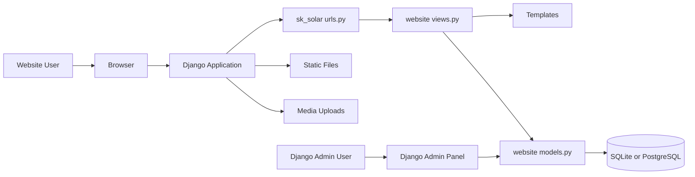
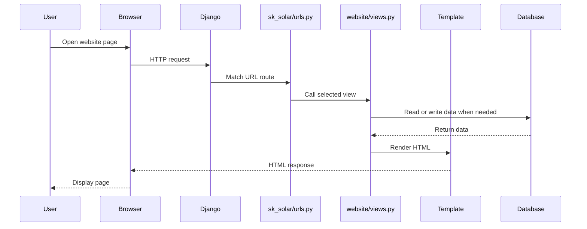
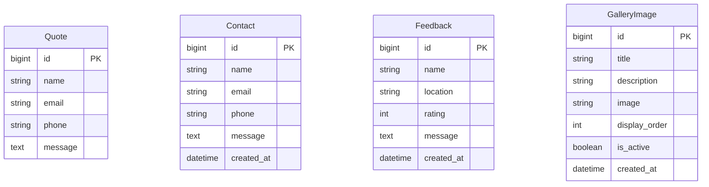
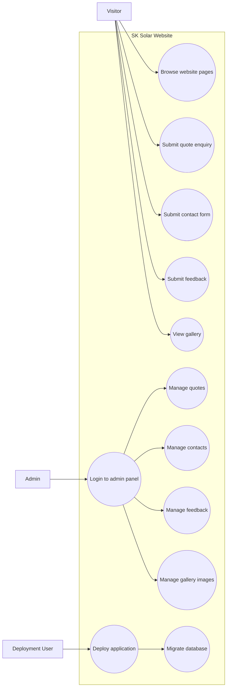
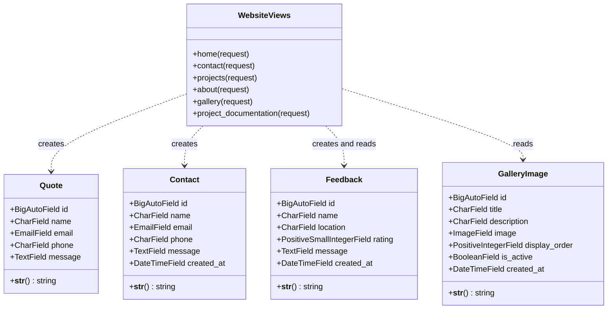
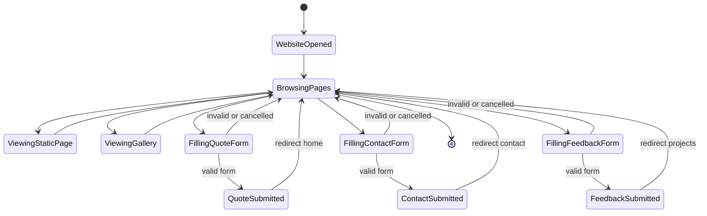

# SK Solar Project Documentation

## 1. Introduction

SK Solar is a Django-based web application developed for a solar technology and solar services business. The project presents company information, solar products, service details, project work, customer feedback, gallery images, and enquiry/contact forms.

The website is designed to help visitors understand the services offered by SK Solar and contact the business for solar installation, maintenance, consultation, and product-related enquiries. It also includes an admin panel where the business owner or admin team can manage quote requests, contact messages, feedback entries, and gallery images.

The project supports local development with SQLite and production deployment with PostgreSQL through Render. Static files are handled using WhiteNoise, and the production server uses Gunicorn.

Main goals of the project:

- Provide a professional website for a solar business.
- Show solar products, services, projects, and gallery images.
- Collect quote requests from visitors.
- Collect contact form submissions.
- Collect and display customer feedback.
- Provide an admin panel for managing website data.
- Support production deployment on Render.

## 2. System Architecture

The SK Solar project follows the standard Django architecture. The browser sends a request to the Django application. The root URL configuration maps the requested URL to a view function. The view function processes the request, communicates with the database when required, and renders the appropriate HTML template.

Main architecture layers:

- **Client Layer:** Browser used by website visitors and admin users.
- **Routing Layer:** `sk_solar/urls.py` maps URLs to view functions.
- **View Layer:** `website/views.py` handles page rendering and form submissions.
- **Model Layer:** `website/models.py` defines database tables.
- **Template Layer:** `templates/` contains HTML pages.
- **Static Layer:** `static/` contains CSS, images, and frontend assets.
- **Media Layer:** `media/` stores uploaded gallery images.
- **Database Layer:** SQLite is used locally, and PostgreSQL is supported for production.
- **Admin Layer:** Django admin is used to manage records.

Important project files:

```text
Sk_Solar_new/
  manage.py
  requirements.txt
  render.yaml
  build.sh
  PROJECT_DOCUMENTATION.md
  sk_solar/
    settings.py
    urls.py
    asgi.py
    wsgi.py
  website/
    admin.py
    models.py
    views.py
    migrations/
    management/
      commands/
        ensure_admin_user.py
        migrate_sqlite_to_postgres.py
  templates/
  static/
  media/
```

## 3. Database Design

The project uses Django ORM models to define database tables. The main models are `Quote`, `Contact`, `Feedback`, and `GalleryImage`.

### Quote Table

The `Quote` model stores quote or enquiry requests submitted from the home page.

Fields:

| Field | Type | Description |
| --- | --- | --- |
| `id` | BigAutoField | Primary key |
| `name` | CharField | Visitor name |
| `email` | EmailField | Visitor email address |
| `phone` | CharField | Visitor phone number |
| `message` | TextField | Visitor requirement or message |

### Contact Table

The `Contact` model stores contact form submissions.

Fields:

| Field | Type | Description |
| --- | --- | --- |
| `id` | BigAutoField | Primary key |
| `name` | CharField | Visitor name |
| `email` | EmailField | Visitor email address |
| `phone` | CharField | Visitor phone number |
| `message` | TextField | Contact message |
| `created_at` | DateTimeField | Submission date and time |

### Feedback Table

The `Feedback` model stores customer feedback shown on the projects page.

Fields:

| Field | Type | Description |
| --- | --- | --- |
| `id` | BigAutoField | Primary key |
| `name` | CharField | Customer name |
| `location` | CharField | Customer location |
| `rating` | PositiveSmallIntegerField | Rating from 1 to 5 |
| `message` | TextField | Feedback message |
| `created_at` | DateTimeField | Feedback submission date and time |

The feedback records are ordered by newest first.

### GalleryImage Table

The `GalleryImage` model stores gallery images uploaded through the admin panel.

Fields:

| Field | Type | Description |
| --- | --- | --- |
| `id` | BigAutoField | Primary key |
| `title` | CharField | Image title |
| `description` | CharField | Optional image description |
| `image` | ImageField | Uploaded image file |
| `display_order` | PositiveIntegerField | Display order in gallery |
| `is_active` | BooleanField | Controls whether the image appears on the website |
| `created_at` | DateTimeField | Upload date and time |

Gallery images are ordered by `display_order` first and then by newest image.

## 4. Diagrams

### System Architecture Diagram



### Request Flow Diagram



### Database ER Diagram



### Use Case Diagram



### Class Diagram



### Activity Diagram

```mermaid
flowchart TD
    start([Start]) --> request[Receive HTTP request]
    request --> route[Match URL route]
    route --> method{Request method}
    method -->|GET| loadData{Need database data?}
    loadData -->|Yes| query[Query database]
    loadData -->|No| render[Render template]
    query --> render
    method -->|POST| validate[Validate form data]
    validate --> valid{Valid data?}
    valid -->|No| render
    valid -->|Yes| save[Save database record]
    save --> redirect[Redirect to page]
    render --> response[Return HTML response]
    redirect --> end([End])
    response --> end
```

### State Chart Diagram



## 5. Functional Requirements and Modules

### Public Website Module

The public website module displays information about SK Solar, its products, services, projects, and gallery images.

Main pages:

| URL | Page | Purpose |
| --- | --- | --- |
| `/` | Home | Main landing page and quote form |
| `/about/` | About | Company information |
| `/contact/` | Contact | Contact details and contact form |
| `/gallery/` | Gallery | Active gallery images |
| `/projects/` | Projects | Project details and customer feedback |
| `/documentation/` | Documentation | Project documentation |

### Product Module

The product module contains pages for solar product brands.

Product pages:

- `/tata/`
- `/waaree/`
- `/adani/`
- `/premier/`
- `/utl/`

### Service Module

The service module contains pages for solar services.

Service pages:

- `/residential/`
- `/commercial/`
- `/industrial/`
- `/solar_maintenance/`

### Quote Module

The quote module allows visitors to submit a quote request from the home page.

Required fields:

- Name
- Email
- Phone
- Message

After successful submission, the data is saved in the `Quote` table and the user is redirected to the home page.

### Contact Module

The contact module allows visitors to send messages from the contact page.

Required fields:

- Name
- Email
- Message

The phone field is also saved when provided. After submission, the data is saved in the `Contact` table and the user is redirected to the contact page.

### Feedback Module

The feedback module allows users to submit feedback from the projects page.

Required fields:

- Name
- Location
- Message
- Rating

The rating is validated and limited between 1 and 5. Feedback records are displayed on the projects page.

### Gallery Module

The gallery module displays active images from the `GalleryImage` table. Admin users can upload images, add titles and descriptions, set display order, and activate or deactivate images.

### Admin Module

The Django admin panel allows administrators to manage:

- Quote records
- Contact records
- Feedback records
- Gallery images

## 6. Technical Design and Implementation Details

The project is implemented using Django function-based views. Each URL is mapped to a view function in `website/views.py`.

### Important Views

| View | Responsibility |
| --- | --- |
| `home` | Renders home page and handles quote form |
| `contact` | Renders contact page and handles contact form |
| `projects` | Renders projects page and handles feedback form |
| `gallery` | Loads active gallery images |
| `about` | Renders about page |
| `project_documentation` | Serves project documentation |
| Product views | Render product pages |
| Service views | Render service pages |

### Templates

HTML templates are stored in the `templates/` directory. The project uses Bootstrap, Bootstrap Icons, custom CSS, and static images to create a polished frontend.

Important templates:

- `index.html`
- `about.html`
- `contact.html`
- `gallery.html`
- `projects.html`
- `navbar.html`
- Product templates
- Service templates

### Static Files

Static files are stored in:

```text
static/
```

The main stylesheet is:

```text
static/css/style.css
```

Static images are stored in:

```text
static/images/
```

### Media Files

Uploaded gallery images are stored in:

```text
media/gallery/
```

### Database Configuration

The database is configured in `sk_solar/settings.py`. The project uses `dj_database_url` so that it can switch between SQLite and PostgreSQL based on the `DATABASE_URL` environment variable.

Local development uses SQLite. Production can use PostgreSQL on Render.

### Deployment Configuration

The Render deployment configuration is stored in:

```text
render.yaml
```

The build script is:

```text
build.sh
```

The build script installs dependencies, collects static files, applies migrations, and creates or updates the admin user.

## 7. User Interface (UI) and User Experience (UX)

The UI is designed to look modern, professional, and suitable for a solar energy business. The home page includes a strong hero section, product highlights, service cards, project cards, documentation access, and a quote form.

UI features:

- Responsive layout for desktop and mobile devices.
- Navigation bar for easy page access.
- Hero section with strong visual presentation.
- Product and service cards.
- Project showcase section.
- Quote request form.
- Documentation section on the index page.
- Admin panel with Jazzmin styling.
- Bootstrap Icons for visual clarity.

UX goals:

- Visitors should quickly understand the business.
- Users should easily find products and services.
- Quote and contact forms should be simple and direct.
- Gallery images should help build trust.
- Admin users should be able to manage content without editing code.

## 8. Installation and Setup Guide

### Step 1: Open the Project Directory

```bash
cd Sk_Solar_new
```

### Step 2: Create a Virtual Environment

```bash
python -m venv venv
```

### Step 3: Activate the Virtual Environment

On Windows PowerShell:

```powershell
.\venv\Scripts\Activate.ps1
```

### Step 4: Install Dependencies

```bash
pip install -r requirements.txt
```

### Step 5: Run Migrations

```bash
python manage.py migrate
```

### Step 6: Create a Superuser

```bash
python manage.py createsuperuser
```

### Step 7: Run the Development Server

```bash
python manage.py runserver
```

Open the website:

```text
http://127.0.0.1:8000/
```

Open the admin panel:

```text
http://127.0.0.1:8000/admin/
```

### Environment Variables

| Variable | Purpose |
| --- | --- |
| `DJANGO_SECRET_KEY` | Secret key for production |
| `DEBUG` | Controls debug mode |
| `ALLOWED_HOSTS` | Allowed hostnames |
| `CSRF_TRUSTED_ORIGINS` | Trusted origins for CSRF protection |
| `DATABASE_URL` | PostgreSQL connection URL |
| `SQLITE_PATH` | Optional custom SQLite path |
| `DJANGO_SUPERUSER_USERNAME` | Admin username for deployment |
| `DJANGO_SUPERUSER_EMAIL` | Admin email for deployment |
| `DJANGO_SUPERUSER_PASSWORD` | Admin password for deployment |

## 9. Testing

Testing should confirm that all pages, forms, database operations, and admin functions work correctly.

### Recommended Test Cases

| Test Case | Expected Result |
| --- | --- |
| Open home page | Home page loads successfully |
| Submit quote form with valid data | Quote record is created |
| Submit quote form with missing data | Record is not created |
| Open contact page | Contact page loads successfully |
| Submit contact form with valid data | Contact record is created |
| Open projects page | Projects page loads successfully |
| Submit feedback with valid rating | Feedback record is created |
| Submit feedback with invalid rating | Rating is corrected between 1 and 5 |
| Open gallery page | Active gallery images are displayed |
| Add gallery image in admin | Image appears when active |
| Deactivate gallery image | Image is hidden from gallery |
| Open documentation page | Documentation file is displayed |
| Open admin panel | Admin login page appears |

### Django Check Command

Run this command to check project configuration:

```bash
python manage.py check
```

### Migration Test

Run:

```bash
python manage.py makemigrations
python manage.py migrate
```

The expected result is that all migrations are created and applied without errors.

## 10. Security Considerations and Recommendations

The project already includes several important security settings, especially for production mode.

Existing security features:

- CSRF protection is enabled through Django middleware.
- Secure cookies are enabled when `DEBUG=False`.
- `ALLOWED_HOSTS` is configured through environment variables.
- `CSRF_TRUSTED_ORIGINS` is configured for production.
- Secret key can be stored in `DJANGO_SECRET_KEY`.
- Admin user can be created using environment variables instead of hardcoding credentials.

Recommendations:

- Always set `DEBUG=False` in production.
- Never commit real secret keys or passwords.
- Use a strong `DJANGO_SECRET_KEY`.
- Use strong admin passwords.
- Restrict admin access where possible.
- Keep Django and dependencies updated.
- Validate and sanitize user form input.
- Add rate limiting or spam protection for public forms.
- Use HTTPS in production.
- Back up the production database regularly.
- Avoid storing production media and database backups inside the public repository.

## 11. Future Enhancements

Possible improvements for the project:

- Add email notifications for quote and contact form submissions.
- Add CAPTCHA or spam protection to public forms.
- Add search and filter options in the gallery.
- Add a testimonial approval workflow.
- Add a dashboard for enquiry statistics.
- Add blog or news pages for solar awareness content.
- Add SEO metadata for every page.
- Add sitemap and robots.txt.
- Add automated tests using Django TestCase or pytest.
- Add image compression for uploaded gallery images.
- Add cloud media storage for production uploads.
- Add role-based admin permissions.
- Add downloadable brochures or solar plans.
- Add WhatsApp integration for quick enquiries.

## 12. Conclusion

The SK Solar project is a complete Django website for a solar technology business. It provides a professional public website, enquiry forms, contact management, feedback handling, gallery image management, admin control, documentation access, and deployment support.

The project is structured in a clear Django pattern, making it easy to maintain and extend. With future improvements such as email notifications, spam protection, SEO enhancements, automated testing, and cloud media storage, the website can become more powerful, secure, and business-ready.
